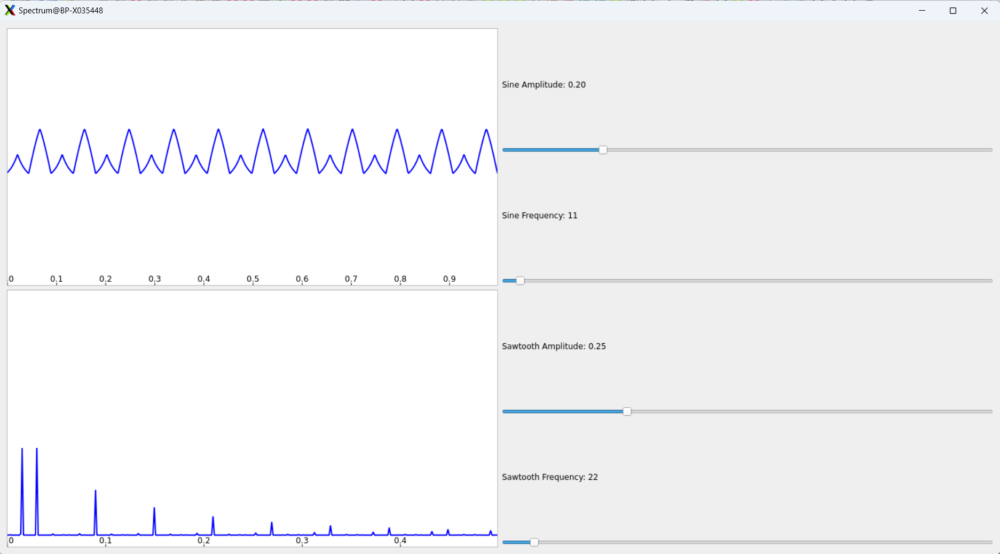

# GPU_Specialization_Capstone_Project

## Contents

1. [Docker :package:](#docker)
2. [Build :package:](#build)
3. [Run :running:](#run)

### Docker :hammer <a name="docker"></a>

**Build docker image**
```shell
make build
```
**Open shell in docker container**
```shell
make shell
```

### Build :hammer <a name="build"></a>

```shell
cd spectrum && make
```

### Run :running: <a name="build"></a>

```shell
./spectrum
```




